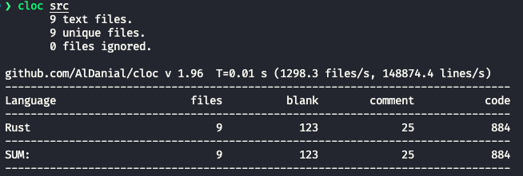

# 《高级数据库系统》课程实验

学号：SA22218106 姓名：邹鹏

本次《高级数据库系统》课程实验基于 **Rust** 语言，实现了一个存储和缓存管理器。

[toc]

## 实验内容

实验所涉及技术包括缓存管理、散列技术、文件存储结构、模块接口实现等。实验核心内容包括：
- 构建 5 万个 page（页号从0到49999）的堆文件 `data.dbf`，基于目录的结构来组织文件，因此存储管理器根据页号即可快速请求读写指定位置的 page。
- **缓存管理器实现了 LRU 和 Clock 置换算法**，缓存块 frame 大小和磁盘 page 大小相同。
  - Lru 基于哈希 + 双向链表实现，所有操作时间复杂度为 $O(1)$
  - Clock 基于哈希 + 双向循环链表实现，victim 操作时间复杂度为 $O(n)$，插入和删除操作时间复杂度为 $O(1)$
- 使用 trace 文件 `data-5w-50w-zipf.txt` 验证所实现的存储和缓存管理器的功能和性能。
- 更改缓存器管理器大小 `FRAME_NUM` 对比分析实验结果；
- 每一个组件如缓存管理器、存储管理器、Lru 替换策略、Clock 替换策略都提供了测试用例，验证功能完整性。

## 设计与实现

### 存储管理器

构建 5 万个 page（页号从0到49999）的堆文件 `data.dbf`，基于目录的结构来组织文件，因此存储管理器根据页号即可快速请求读写指定位置的 page。
```Rust
let mut file = std::fs::File::create(DB_FILE_NAME).unwrap();
let buf = vec![0 as u8; 50000 * PAGE_SIZE];
file.write_all(&buf).unwrap();
```

因此，存储管理器只需根据 page id 即可找到对应的 page 在文件中的偏移量，也就是 `page_id * PAGE_SIZE` 然后进行相应磁盘读写操作。存储管理器核心功能 (`read_page`, `write_page`) 实现如下：
- `read_page`: 根据 page_id 计算偏移量，然后读取文件的对应 page 数据。
- `write_page`: 根据要写入的 page_id 计算偏移量，然后将内存中 frame 的 Data 数据写入到文件中。
```Rust
pub struct DSMgr {
    curr_file: File,
    num_pages: usize,
}

impl DSMgr {
    pub fn read_page(&mut self, page_id: usize) -> Result<Data, std::io::Error> {
        let offset = page_id * PAGE_SIZE;

        self.seek(offset);
        let mut buffer: Data = [0; PAGE_SIZE];
        self.curr_file.read_exact(&mut buffer)?;
        Ok(buffer)
    }

    pub fn write_page(&mut self, page: &mut Page) -> Result<(), std::io::Error> {
        let page_id = page.get_page_id().unwrap();
        let offset = page_id * PAGE_SIZE;
        let data = page.get_data();

        self.seek(offset);
        self.curr_file.write_all(data)?;
        self.curr_file.flush()
    }

}
```

### 缓存管理器

缓存管理器实现了 LRU 和 Clock 置换算法，缓存块 frame 大小和磁盘 page 大小相同，均为 4096 字节。缓存管理器中的 frame 数量默认为 1024，可以在`config.rs`进行修改。

缓存管理器定义如下：
```Rust
pub struct BMgr {
    data_storage_manager: DSMgr,
    // capacity: usize,
    free_list: Vec<usize>,
    pages: Vec<Page>,
    replacer: Box<dyn Replacer>,
    page_table: HashMap<PageId, FrameId>,
    num_write_io: usize,
    num_read_io: usize,
    num_hits: usize,
}

pub struct Page {
    page_id: Option<PageId>,
    data: Data,
    is_dirty: bool,
    pin_count: usize,
}
```
`data_storage_manager`: 存储管理器作为成员，用于读写磁盘文件。

缓存控制逻辑由 `free_list` 和 `pages` 两个成员保证，`free_list` 用于存储空闲 frame 的 frame_id，初始时所有 frame 都是空闲的，也就是有 `FRAME_NUM` 大小个 frame_id。`pages` 用于存储所有 frame_id 对应的缓存 page。

`pages` 存储所有 frame_id 对应的缓存 page，初始时所有 frame_id 对应的 page 的 page_id 为 None。缓存 page 信息包括：
- 在磁盘中对应的 `page_id`。
- `data`，缓存的数据。
- `is_dirty`，是否为脏页，标记缓存的 page 是否被修改过，该页当被替换出去时，如果是脏页就需要会写到磁盘对应的 page 中。
- `pin_count`，用户占用计数，只有 pin_count 为 0时，也就是该缓存页不被占用时，才能被替换。

`page_table`: 用于存储 page_id 和 frame_id 的映射关系，这样可以快速查找缓存的 page_id 对应的 frame_id。

缓存管理器核心功能 (`fix_page`, `unfix_page`) 实现如下：
- `fix_page`: 缓存管理器根据 page id 向存储管理器发起读页请求，并缓存到内存 frame 中。
- `unfix_page`: 释放缓存页，如果缓存页被修改过，就会将缓存页写回磁盘。
```Rust
impl BMgr {
    pub fn fix_page(&mut self, page_id: PageId, is_dirty: bool) -> Option<FrameId> {
        if let Some(frame_id) = self.page_table.get(&page_id) {
            self.num_hits += 1;
            let page = &mut self.pages[*frame_id];
            if page.get_pin_count() == 0 {
                self.replacer.remove(*frame_id);
            }
            page.increment_pin_count();
            if is_dirty {
                page.set_dirty(true);
            }
            Some(*frame_id)
        } else {
            if let Some(frame_id) = self.select_victim() {
                let page = &mut self.pages[frame_id];
                // TODO optimize
                page.get_data()
                    .copy_from_slice(&self.data_storage_manager.read_page(page_id).unwrap());
                self.num_read_io += 1;
                self.page_table.insert(page_id, frame_id);
                page.increment_pin_count();
                page.set_page_id(page_id);
                if is_dirty {
                    page.set_dirty(true);
                }
                Some(frame_id)
            } else {
                None
            }
        }
    }

    pub fn unfix_page(&mut self, page_id: PageId) -> Option<FrameId> {
        if let Some(frame_id) = self.page_table.get(&page_id) {
            let page = &mut self.pages[*frame_id];
            assert!(page.get_pin_count() > 0);
            page.decrement_pin_count();
            if page.get_pin_count() == 0 {
                self.replacer.insert(*frame_id);
            }
            Some(*frame_id)
        } else {
            None
        }
    }
```

### 替换策略

缓存管理器中的 `replacer` 用于实现 Lru 和 Clock 置换算法，这里使用了 trait 对象作为接口。
```Rust
pub trait Replacer {
    fn victim(&mut self) -> Option<FrameId>;
    fn insert(&mut self, frame_id: usize);
    fn remove(&mut self, frame_id: usize);
    fn print(&self);
    fn size(&self) -> usize;
}
```

分别为 Lru 和 Clock 实现了 `Replacer` trait，实现如下：

#### Lru 置换算法

使用哈希表+双向链表实现了 Lru 替换策略，保证所有操作的时间复杂度是 $O(1)$，双向链表头部节表示 LRU，尾部节点表示 MRU。将 frame id 插入双向链表时：
- 如果插入的 frame_id 已经在链表中，就将该 frame_id 移动到链表尾部。
- 否则，如果链表已满，就将链表头部节点移除，然后将 frame_id 插入到链表尾部，并将节点插入到哈希表中。
- 如果链表未满，就将 frame_id 插入到链表尾部，并将节点插入到哈希表中。


核心功能具体实现如下：
```Rust
struct Node {
    frame_id: FrameId,
    prev: Option<NonNull<Node>>,
    next: Option<NonNull<Node>>,
}

pub struct LruReplacer {
    head: Option<NonNull<Node>>, // head -> LRU
    tail: Option<NonNull<Node>>, // tail -> MRU
    map: HashMap<FrameId, NonNull<Node>>,
    capacity: usize,
    marker: std::marker::PhantomData<Node>, // mark lifetime
}

impl Replacer for LruReplacer {
    fn victim(&mut self) -> Option<FrameId> {
        let head = self.head?;
        let victim_frame_id = unsafe { head.as_ref().frame_id };
        self.detach(head);
        self.map.remove(&victim_frame_id);
        drop(head.as_ptr());
        Some(victim_frame_id)
    }

    fn insert(&mut self, frame_id: usize) {
        // remove old node if exists
        if let Some(node) = self.map.get(&frame_id) {
            let node = *node;
            self.detach(node);
            self.attach(node);
        } else {
            let node = Box::into_raw(Box::new(Node::new(frame_id)));
            let node = unsafe { NonNull::new_unchecked(node) };
            self.map.insert(frame_id, node);
            self.attach(node);
            if self.map.len() > self.capacity {
                self.victim();
            }
        }
    }

    fn remove(&mut self, frame_id: usize) {
        if let Some(node) = self.map.get(&frame_id) {
            let node = *node;
            self.detach(node);
            self.map.remove(&frame_id);
            drop(node.as_ptr());
        }
    }
}
```


#### Clock 置换算法

使用哈希表+双向循环链表实现了 Clock 替换策略，给每一个节点增加一个 bool 数据类型的 ref 属性，当节点对应页面被使用的时候，将 ref 置为true。此外还需创建一个 clock 的指针 hand 来周期性的指向缓存中的每一个节点。需要换出时，换出的是指针 hand 遇见的第一个 ref=false 的节点。当 hand 遇见一个 REF=true 的节点时，将REF置为false后，指向下一个节点。因此 Clock 算法 victim 操作的时间复杂度是 $O(n)$，插入删除操作时间复杂度都是 $O(1)$。

如下是 Clock 为满节点时，frame1 被替换牺牲的逻辑示意图：


核心功能具体实现如下，插入操作时候需要考虑双向循环链表为空的以及为满时的边界情况。
```Rust
struct Node {
    frame_id: FrameId,
    ref_: bool,
    prev: Option<NonNull<Node>>,
    next: Option<NonNull<Node>>,
}

pub struct ClockReplacer {
    hand: Option<NonNull<Node>>, // current ptr
    map: HashMap<FrameId, NonNull<Node>>,
    capacity: usize,
    marker: std::marker::PhantomData<Node>, // mark lifetime
}

impl Replacer for ClockReplacer {
    fn victim(&mut self) -> Option<FrameId> {
        loop {
            let mut hand = self.hand?;
            unsafe {
                if hand.as_ref().ref_ {
                    hand.as_mut().ref_ = false;
                    hand = hand.as_ref().next.unwrap();
                    self.hand = Some(hand);
                } else {
                    let frame_id = hand.as_ref().frame_id;
                    self.remove(hand.as_mut().frame_id);
                    return Some(frame_id);
                }
            }
        }
    }

    fn insert(&mut self, frame_id: usize) {
        if let Some(node) = self.map.get(&frame_id) {
            // already in the replacer
            let mut node = *node;
            unsafe {
                node.as_mut().ref_ = true;
            }
            return;
        }

        if self.size() == 0 {
            let node = Box::into_raw(Box::new(Node::new(frame_id)));
            let mut node = unsafe { NonNull::new_unchecked(node) };
            unsafe {
                node.as_mut().prev = Some(node);
                node.as_mut().next = Some(node);
            }
            self.hand = Some(node);
            self.map.insert(frame_id, node);
        } else if self.size() < self.capacity {
            let node = Box::into_raw(Box::new(Node::new(frame_id)));
            let mut node = unsafe { NonNull::new_unchecked(node) };
            let mut hand = self.hand.unwrap();
            unsafe {
                let mut tmp = hand.as_mut().prev.unwrap();
                hand.as_mut().prev = Some(node);
                node.as_mut().next = Some(hand);
                node.as_mut().prev = Some(tmp);
                tmp.as_mut().next = Some(node);
            }
            self.map.insert(frame_id, node);
        } else {
            // full
            loop {
                let mut hand = self.hand.unwrap();
                unsafe {
                    if hand.as_ref().ref_ {
                        hand.as_mut().ref_ = false;
                        hand = hand.as_ref().next.unwrap();
                        self.hand = Some(hand);
                    } else {
                        let old_frame_id = hand.as_ref().frame_id;
                        self.map.remove(&old_frame_id);
                        hand.as_mut().ref_ = true;
                        hand.as_mut().frame_id = frame_id;
                        self.map.insert(frame_id, hand);
                        return;
                    }
                }
            }
        }
    }

    fn remove(&mut self, frame_id: usize) {
        if let Some(node) = self.map.get(&frame_id) {
            let node = *node;
            if self.size() == 1 {
                self.hand = None;
            } else {
                unsafe {
                    if self.hand.unwrap().as_ref().frame_id == frame_id {
                        self.hand = Some(node.as_ref().next.unwrap());
                    }
                }
            }
            self.detach(node);
            self.map.remove(&frame_id);
            drop(node.as_ptr());
        }
    }
}
```

## 运行结果

### 测试组件功能

源码中为 data_storage_manager，buffer_manager，lru_replacer，clock_replacer 都实现了测试用例，可以通过 `cargo test` 命令运行测试用例。


### 性能测试

按行读取 trace 文件 data-5w-50w-zipf.txt，修改源码`config.rs`中的 FRAME_NUM 更改缓存器管理器大小。默认值为 1024。运行命令时可以选择 LRU 或者 Clock 算法。

```
cargo run --release -- [lru|clock] [file_path]
```

#### FRAME_NUM = 1024

lru 运行结果：


clock 运行结果：


经测试发现，在该文件下按行读取条件下，两个算法的 io 次数和命中率均为一致的。所以下面展示不同 FRAME_NUM 时，只展示 lru 算法的运行结果。

#### FRAME_NUM = 2048


#### FRAME_NUM = 4096


#### FRAME_NUM = 8192


#### FRAME_NUM = 32768


#### FRAME_NUM = 50000


#### FRAME_NUM = 65536


表格统计如下：
| FRAME_NUM | READ_IO | WRITE_IO | TOTAL_IO | HIT_NUM  | HIT_RATE | TRACE_TIME |
| :-------: | :-----: | :------: | :------: | :------: | :------: | :--------: |
| 1024      | 330435  | 172386   | 502821   | 169565   | 33.913%  | 1.70 s     |
| 2048      | 290431  | 153699   | 444130   | 209569   | 41.914%  | 1.27 s     |
| 4096      | 244560  | 131405   | 375965   | 255440   | 51.088%  | 0.954 s    |
| 8192      | 191254  | 104102   | 295356   | 295356   | 61.749%  | 0.834 s    |
| 32768     | 67625   | 23163    | 90788    | 308746   | 86.475%  | 0.688 s    |
| 50000     | 47023   | 0        | 47023    | 452977   | 90.5954% | 0.280 s    |
| 65536     | 47023   | 0        | 47023    | 452977   | 90.5954% | 0.246 s    |

## 总结

从实验结果来看，随着缓存器大小 FRAME_NUM 的增加，IO 数量逐渐减少，命中率逐渐增加，trace 时间逐渐减少。当 FRAME_NUM 超过所需要请求的页面数量(47023)时，命中率达到 90.5954%，IO 数量为 47023，命中率和 IO 数量此后不再变化。这是因为当 FRAME_NUM 超过所请求的页面数，缓存器已经能够完全缓存所有数据，只有在最开始冷启动时页面缺失才会有 IO 发生，此后每一次页面请求都会命中。

本次实验根据实验描述文档和课程所学知识，使用 Rust 实现了一个存储和缓存管理器。过程中不仅巩固了数据库和数据结构算法方面的知识，同时也学习了 Rust 语言的一些特性，如所有权、生命周期、trait、错误处理机制等，锻炼了使用 Rust 语言面向系统编程，构建可靠、安全、高效的系统的能力，收获颇丰。

## 源码运行说明

根据 [Rust 官方文档](https://www.rust-lang.org/zh-CN/tools/install) 安装 Rust 环境和 Cargo 包管理器。

下载源代码和测试数据：
```
git clone https://github.com/ZonePG/ustc-adbs-lab-rust.git
cd ustc-adbs-lab-rust
```

代码目录如下：
```
├── Cargo.toml // Cargo 配置文件
├── README.md
├── data       // 测试数据文件
├── data-5w-1000-zipf.txt
├── data-5w-1w-zipf.txt
└── data-5w-50w-zipf.txt
src
├── buffer_manager.rs       // 缓存管理器
├── config.rs               // 命令行参数配置
├── data_storage_manager.rs // 存储管理器
├── main.rs
├── page.rs                 // page 结构体
└── replacer
    ├── clock_replacer.rs   // Clock 置换算法
    ├── lru_replacer.rs     // LRU 置换算法
    ├── mod.rs
    └── replacer.rs         // 置换算法接口
```

共计约 900 行代码实现：



### Run

编译运行格式如下，其中 `lru` 和 `clock` 分别表示 LRU 和 Clock 置换算法，`file_path` 表示测试数据文件路径。
```
cargo run --release -- [lru|clock] [file_path]
```

例如：
```
cargo run --release -- clock data/data-5w-50w-zipf.txt
```

### Test

运行所有组件测试用例：
```
cargo test
```

运行指定测试用例，并允许标准输出：
```
cargo test  -- --nocapture test_func_name
cargo test  -- --nocapture buffer_manager
```

### 为什么使用 Rust

Rust 是一门系统级编程语言，它的设计目标是提供一个安全、高效、并发的编程语言。本次实验使用 Rust 所感受的好处有：
- **可靠性/安全性**：Rust 丰富的类型系统和所有权模型保证了内存安全，并能够在编译时消除许多错误。
- **运行效率**: Rust 通过编译时的内存分配和类型检查，以及运行时的内存安全保证和零成本抽象，使得 Rust 代码的运行效率与 C/C++ 相当。
- **生产力**: Rust 有着强大的包管理工具 Cargo，能够方便地管理依赖包，同时也提供了丰富的测试工具，能够方便地进行测试。
